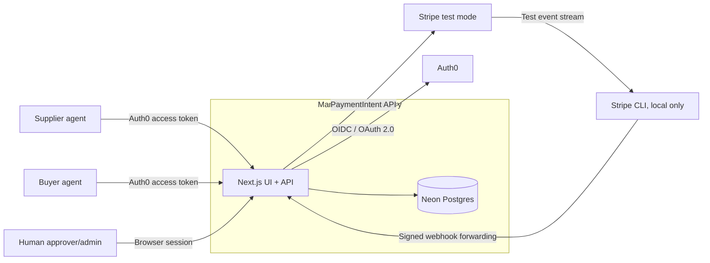
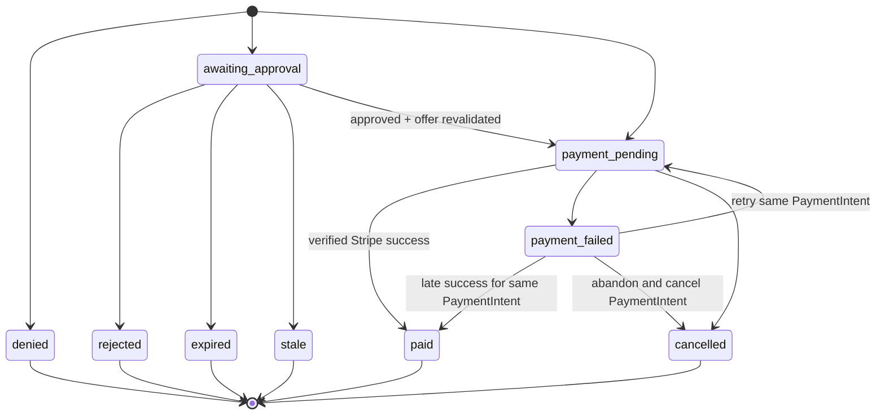

# Mandate architecture

Status: implemented MVP architecture

Scope: the Auth0 + Stripe hackathon demo described in [MANDATE.md](MANDATE.md)

## Verdict

Build Mandate as one strict-TypeScript Next.js application with one Postgres
database. The same deployable serves the human approval UI, agent-facing HTTP
API, policy evaluation, order workflow, audit trail, and Stripe webhook.

Auth0 owns identity, organization membership, and coarse permissions. Mandate
owns procurement policy and approval decisions. Stripe owns payment method and
payment lifecycle state. Postgres is the transactional source of truth.

This is deliberately a single-deployable architecture. It does not
need microservices, a message bus, a generic policy engine, an ORM, or separate
frontend and backend applications.

> **Commercial boundary:** the MVP uses Stripe test mode to demonstrate a
> governed buyer charge. It does not settle funds to suppliers. Live payments
> are blocked until Mandate's merchant-of-record, Stripe Connect, refund,
> dispute, tax, and supplier-onboarding responsibilities are decided.

## Goals and non-goals

### Goals

- Prove an agent's organization and allowed API operations.
- Publish normalized supplier offers.
- Select the cheapest eligible offer deterministically.
- Enforce supplier, category, delivery, per-order, and period-budget policy.
- Pause only explicitly overridable exceptions for a human decision.
- Create at most one Stripe PaymentIntent per accepted order.
- Preserve an attributable, append-only record of every decision and state
  transition.
- Run the seven-step demo locally with Auth0, Stripe test mode, and Stripe CLI.

### Non-goals

- Real supplier settlement, fulfillment, tax, refunds, disputes, or FX.
- Multi-line, multi-supplier, or partially fulfilled orders.
- AI-based product matching or a generic policy language.
- Multiple approval levels or delegated approval chains.
- High availability or offline operation.
- Cryptographic audit proofs or a compliance archive.

## System context



The browser and both agent types are untrusted clients. Auth0, Stripe, and
supplier-provided catalog content are external trust boundaries. A valid
identity never implies permission to access another organization's data.

## Ownership boundaries

| Boundary | Owns | Must not own |
|---|---|---|
| Auth0 | Authentication, organization membership, M2M grants, token scopes, human roles | Mandates, order policy, approval state |
| Request auth adapter | Token/session validation and an immutable actor context | Business decisions |
| Catalog | Supplier-owned offers and normalized product data | Buyer policy or payment recipients |
| Policy evaluator | A pure `allow`, `require_approval`, or `deny` decision with reason codes | I/O, order mutation, payment calls |
| Order workflow | Idempotency, snapshots, budgets, approvals, legal state transitions | Authentication protocol details |
| Stripe adapter | PaymentIntent create/retrieve/confirm and normalized Stripe errors | Authorization to spend |
| Webhook handler | Signature verification, deduplication, payment-state reconciliation | Catalog or policy mutation |
| Audit writer | Append-only security and business events | Mutable aggregate state |

These are code boundaries inside one application, not network services.
Route handlers validate and adapt HTTP input, then call feature functions.
Only the order workflow coordinates domain state and external payment effects.

### Stripe Connect test configuration

Supplier accounts use Accounts v2 recipient configuration with Dashboard:
Express, fee collection managed by Mandate, negative balance liability owned by
Mandate, and only `stripe_balance.stripe_transfers` requested. The MVP creates
US accounts; cross-border supplier onboarding is deferred.

Before testing, acknowledge platform negative-balance liability in the Stripe
test-mode Connect platform profile. Configure test or restricted secret and
publishable keys through `STRIPE_SECRET_KEY` and
`NEXT_PUBLIC_STRIPE_PUBLISHABLE_KEY`; never commit their values.

## Security invariants

These rules are implementation blockers, not recommendations:

1. Derive the actor and tenant from a verified Auth0 token or session. Never
   accept an authoritative organization ID, actor ID, amount, currency,
   supplier, Stripe customer, or Stripe account from request JSON.
2. Validate token signature and algorithm, issuer, audience, expiry, subject,
   organization, actor type, and required scope. Authorization defaults to
   deny.
3. Scope every read and write by the actor's organization. Buyer actors match
   `buyer_org_id`; supplier actors match `supplier_org_id` and receive a
   restricted response projection. An unscoped `orders`, `mandates`,
   approvals, or audit query is a defect.
4. Reload catalog prices and compute totals on the server using integer minor
   currency units. Client-provided totals are ignored. Prices and quantities
   must be positive safe integers within explicit caps; check multiplication
   before performing it and reject overflow or a total above the order cap.
5. An approval is one-time, expiring, and bound to the exact immutable order,
   offer snapshot, amount, currency, supplier, delivery location, and mandate
   version/hash. Any changed input requires a new order and decision.
6. Evaluate budget and persist the order in one serialized transaction.
   Pending approvals reserve budget until rejection, cancellation, or expiry.
7. Persist an order before contacting Stripe. Create one unconfirmed
   PaymentIntent idempotently, persist its ID, and only then confirm it. Create
   no more than one PaymentIntent for an order.
8. Only a verified Stripe webhook can mark an order paid. A browser redirect,
   agent callback, or successful Stripe API response cannot.
9. Verify webhooks against the untouched raw request body. Deduplicate Stripe
   event IDs and tolerate duplicate and out-of-order events.
10. Append the policy decision, approval actor, state transition, and payment
    reconciliation in the same transaction as the corresponding state change.
11. Keep tokens, secrets, payment client secrets, card data, and unnecessary
    personal data out of logs, Stripe metadata, and audit payloads.
12. Treat catalog names and descriptions as untrusted data: validate size and
    format, escape them in HTML, and never treat them as agent instructions.
13. Use parameterized SQL exclusively. Secrets come from the environment, and
    client errors never expose Auth0, Stripe, SQL, or stack details.
14. Product key, category, and unit mappings used by policy are server-owned.
    A supplier cannot relabel an offer into an allowed category.

## Identity and authorization

### Agents

Register the Mandate API in Auth0 and use Client Credentials for buyer and
supplier agents. Require organization context and explicit organization grants;
keep `allow_any_organization` disabled.

| Scope | Actor | Permission |
|---|---|---|
| `catalog:write` | Supplier agent | Replace its own organization's catalog |
| `offers:read` | Buyer agent | Search offers visible to its organization |
| `orders:create` | Buyer agent | Request a purchase for its organization |
| `orders:read` | Buyer/supplier agent | Read only its side of an order |

The API validates `iss`, `aud`, `exp`, `sub`, `org_id`, token algorithm, and
scope with a maintained Auth0/JWT library. It uses `org_id`, not the mutable
organization display name, as the tenant key.

Auth0 organization-aware M2M access is plan-dependent. Confirm the hackathon
tenant supports it before implementation. If it does not, use one M2M client
per organization and a server-side client identity claim (`azp` or
`client_id`, matching the configured token profile) to organization mapping.
Do not fall back to a caller-supplied organization field.

### Humans

Use Authorization Code with PKCE and an Auth0 organization-aware server
session.

| Permission | Human |
|---|---|
| `mandates:write` | Create an immutable mandate version for their organization |
| `approvals:read` | View their organization's pending approvals |
| `approvals:decide` | Approve or reject an exact pending order |
| `orders:read` | View organization orders and audit history |

Approval additionally requires the buying organization's `org_id`, a current
approver permission, a same-origin CSRF check, and a compare-and-set transition.
The requester cannot approve its own order. A session that changes organization
must receive a new organization-bound view of all data.

Every browser-session mutation, including mandate creation and approval,
requires CSRF protection. Agent routes require bearer access tokens and do not
accept cookie authentication.

The demo may use the human's fresh Auth0 login as confirmation. Require step-up
authentication for material exceptions before live payments.

## Domain model

### Policy semantics

Each immutable mandate version contains:

- validity start and end in UTC;
- one currency;
- an autonomous per-order limit;
- a hard exception limit;
- an explicit budget-window start, end, and limit;
- allowed supplier organization IDs;
- allowed normalized product categories; and
- allowed delivery-location IDs.

Exactly one mandate version per buyer organization may be `active`, enforced
by a partial unique index. Creating a version supersedes the prior version in
the same transaction. New orders load only the active version. An
`awaiting_approval` order whose mandate is expired, revoked, or superseded
becomes `stale` and cannot start payment. A mandate change does not regress a
payment already initiated; that PaymentIntent must finish or be safely
cancelled and reconciled.

The evaluator returns one decision and stable reason codes:

| Decision | Conditions |
|---|---|
| `deny` | Missing/inactive mandate, tenant mismatch, malformed quantity, stale/inactive offer, currency mismatch, disallowed supplier/category/delivery location, or total above the hard exception limit |
| `require_approval` | Otherwise eligible, but above the autonomous order limit or above the remaining period budget |
| `allow` | All hard controls pass and both autonomous limits pass |

Hard restrictions are not human-overridable in the MVP. This keeps an
approval from silently becoming unrestricted procurement. Policy inputs and
output are deterministic and serializable; no network or database access is
allowed inside the evaluator.

### Offer selection

A purchase request contains one normalized product key, an exact normalized
unit, a quantity, and a delivery-location ID. It does not choose a supplier or
price. The MVP defines no unit conversions.

The demo seed owns the allowed supplier-SKU to product-key/category/unit
mapping. Supplier publication may update only price, advisory quantity,
validity, display text, and active state for its registered SKUs. Unknown SKUs
and attempts to change classification are rejected. Self-service product
onboarding requires a separate trusted review workflow and is deferred.

Mandate:

1. loads active, unexpired offers for the exact product key and unit with
   sufficient advisory stock;
2. filters suppliers, categories, currency, and mandate delivery policy;
3. computes each total from its authoritative unit price; and
4. selects the lowest total, breaking ties by supplier ID.

Multi-line orders, split orders, unit conversion, and semantic/AI matching are
deferred. A published offer is standing supplier acceptance: Mandate reserves
its available quantity atomically when it creates an eligible order, without a
supplier acceptance step. The demo assumes every seeded supplier serves every
seeded delivery location allowed by the buyer's mandate. Mandate validates the
frozen offer again after any human-approval wait. A changed or expired waiting
offer makes the order `stale`, releases its inventory and budget reservations,
and requires a new request. An approved order is never rewritten in place.

### Data model

| Table | Essential data and constraints |
|---|---|
| `organizations` | Internal ID, unique Auth0 `org_id`, name, buyer/supplier kind, optional Stripe Customer ID |
| `supplier_payment_accounts` | Supplier organization, unique Stripe connected account ID, onboarding/requirements/recipient-transfer state, payout readiness, last Stripe event time |
| `catalog_items` | Supplier organization, immutable registered SKU/product key/category/unit, mutable integer unit price/currency/advisory quantity/validity/display text/active flag, version; unique supplier + SKU |
| `offer_reservations` | One idempotent order reservation against an exact catalog item version and quantity; reserved/released/settled state |
| `mandates` | Buyer organization, version, active/superseded/revoked state, validity, structured policy JSON, schema version, policy hash, creator; unique buyer + version and at most one active per buyer |
| `orders` | Buyer/supplier organizations, requester subject, mandate version/hash, catalog item/version, immutable SKU/product/category/unit/unit-price snapshot, quantity, currency, total, delivery location, status, policy decision/reasons, idempotency key/request hash, approval expiry/actor/time/reason, Stripe create-started timestamp, timestamps, optional unique Stripe PaymentIntent ID; unique buyer + requester + idempotency key |
| `wallet_funding_lots` | Immutable Stripe PaymentIntent/charge source, original and available amount, currency, and availability state |
| `wallet_funding_allocations` | Immutable order-to-funding-lot allocations retaining the Stripe source charge for later supplier transfers |
| `stripe_events` | Unique Stripe event ID, type, object ID, received/processed timestamps |
| `audit_events` | Aggregate, optional organization, event type, actor type/subject, request ID, sanitized payload, timestamp |

Use foreign keys, `CHECK` constraints for states and bounded positive
money/quantities, and unique constraints for idempotency. Store UTC timestamps
and never use floating-point money. At the TypeScript boundary require
`Number.isSafeInteger`, enforce fixed quantity/unit-price/order-total caps, and
check `unit_price <= max_order_total / quantity` before multiplication.
Validate policy JSON and its monetary limits against a versioned runtime
schema before writing it.

`audit_events` is insert-only. Postgres triggers reject update and delete
attempts. This is sufficient for the demo, not a compliance archive.

The demo seed creates internal organization rows keyed to existing Auth0
organization IDs. Unknown organization claims fail closed; they do not
implicitly provision tenants.

## State machines

### Order



Every mutation is a conditional update from an allowed prior state. `paid` is
monotonic: a late failure event cannot regress it.

## HTTP surface

All JSON endpoints use a consistent `{ "data": ... }` success envelope and
`{ "error": { "code", "message", "request_id" } }` error envelope. Error
messages are stable and non-sensitive.

| Method | Route | Authorization and behavior |
|---|---|---|
| `POST` | `/api/mandates` | Human `mandates:write`; validate and create a new immutable organization mandate version |
| `PUT` | `/api/catalog` | Supplier `catalog:write`; validate and atomically update mutable offer data for registered SKUs |
| `GET` | `/api/offers` | Buyer `offers:read`; return eligible normalized offers and reason codes |
| `POST` | `/api/orders` | Buyer `orders:create` plus `Idempotency-Key`; select, price, evaluate, snapshot, and return `201`, `202`, or a denial |
| `GET` | `/api/orders/:id` | A buyer sees its order; a supplier gets only fulfillment fields for an order assigned to it |
| `GET` | `/api/approvals` | Human `approvals:read`; same-organization pending queue |
| `POST` | `/api/orders/:id/approval` | Human `approvals:decide`; `{ decision, reason }` with CSRF and compare-and-set |
| `GET` | `/api/audit` | Human `orders:read`; same-organization filtered audit history |
| `POST` | `/api/webhooks/stripe` | Public ingress; raw-body Stripe signature verification, event allowlist, and deduplication |

Authenticated state-changing routes have request-body and item-count limits,
runtime schema validation, and a fixed-window per-subject rate limit stored
atomically in Postgres. The webhook has its own strict body limit and signature
check.

`POST /api/orders` requires a UUID idempotency key. The database also stores a
hash of the validated request. Reusing the key with the same payload returns
the original order; reusing it with a different payload returns `409`.

## Main flow

```mermaid
sequenceDiagram
    participant B as Buyer agent
    participant M as Mandate
    participant D as Postgres
    participant H as Human approver
    participant S as Stripe

    B->>M: POST /api/orders + token + idempotency key
    M->>D: BEGIN; lock buyer; load offers, mandate, committed spend
    M->>M: Select offer, price, evaluate pure policy
    M->>D: Save immutable order, decision, applicable budget hold, audit; COMMIT

    alt hard denial
        M-->>B: denied + reason codes
    else human exception required
        M-->>B: 202 awaiting_approval
        H->>M: Approve exact order through Auth0 session
        M->>D: Revalidate + conditional payment_pending + audit
        M->>S: Create unconfirmed intent, key order:id:create
        S-->>M: PaymentIntent ID
        M->>D: Persist PaymentIntent ID
        M->>S: Confirm intent, key order:id:confirm
        S-->>M: Current payment state
        M-->>H: Accepted; payment_pending
    else autonomous purchase
        M->>S: Create unconfirmed intent, key order:id:create
        S-->>M: PaymentIntent ID
        M->>D: Persist PaymentIntent ID
        M->>S: Confirm intent, key order:id:confirm
        S-->>M: Current payment state
        M-->>B: 201 payment_pending
    end

    opt PaymentIntent emits an event
        S->>M: Signed payment webhook
        M->>D: Deduplicate, verify mapping/amount/currency, transition, audit
    end
```

The order or approval request waits for the Stripe initiation attempt, not for
payment completion. No payment work starts after returning the HTTP response.
`payment_pending` is the truthful state until the verified webhook arrives.

## Transaction and failure rules

- Use one Postgres transaction and lock the buyer organization row around the
  budget check and order insert so concurrent instances cannot both spend the
  same remaining amount.
- Committed spend includes unexpired `awaiting_approval`, `payment_pending`,
  `payment_failed`, and `paid` orders in the mandate's budget window. A failed
  PaymentIntent keeps its reservation because it can still succeed on retry or
  through a late event. Rejected, expired, stale, and cancelled orders release
  their reservation by leaving that set.
- `payment_pending` is a recoverable orchestration state. Create an unconfirmed
  PaymentIntent with `order:<id>:create`, persist its ID, then confirm it with
  `order:<id>:confirm`, all before responding. If either call times out, retry
  that stage with the same key instead of creating another payment.
- Replaying the original order or approval request resumes any incomplete
  payment stage before returning the existing order. The reconciliation
  command does the same for abandoned requests; no in-process background task
  is required.
- Stripe may prune idempotency records after 24 hours. Automatically retry an
  unknown create result only while the original key is guaranteed retained
  (use a conservative 23-hour cutoff). After that cutoff, keep the order
  `payment_pending`, alert, and require manual Stripe reconciliation by order
  metadata; never issue a fresh create automatically.
- Put only the internal order ID in Stripe metadata. On every payment event,
  cross-check mode, PaymentIntent ID, order mapping, amount, and currency
  before changing state.
- Accept only the Stripe event types used by the state machine. Return `200`
  for an already-recorded event. Unknown or invalid mappings create a
  sanitized operational alert and never change an order.
- Stripe does not guarantee event order. Conditional transitions prevent
  regressions; a successful event for the same PaymentIntent may advance a
  prior failure to `paid`.
- Mark an order `cancelled` and release its budget only after Stripe confirms
  cancellation, or when no PaymentIntent was ever created. If cancellation
  races with success, `paid` wins.
- A small reconciliation command expires waiting approvals, rejects
  superseded mandates, and resumes or retrieves Stripe state for old
  `payment_pending` and `payment_failed` orders within the safe retry window.
  Run it manually in the demo; schedule it before any unattended deployment.
- Auth0/JWKS failure, invalid policy data, and database failure all fail closed.
  Cached signing keys may be used only within the library's configured TTL.

## Audit and operations

Append an audit event for:

- authentication/authorization denial;
- catalog publication;
- mandate version creation;
- offer selection and immutable price snapshot;
- policy inputs, version/hash, outcome, and reason codes;
- order idempotent replay or payload conflict;
- approval request, decision, actor, and expiry;
- every order state transition;
- Stripe request ID, PaymentIntent ID, and accepted event ID; and
- webhook rejection, reconciliation, and unexpected state.

Each inbound request receives a correlation ID that follows its logs and audit
events. Audit payloads contain stable IDs and reason codes, not raw tokens,
secrets, card data, payment client secrets, full webhook bodies, or arbitrary
supplier descriptions.

For the demo, structured application logs plus the approval/audit UI are
enough. Before live payments, add alerts for stuck payments, expired
reservations, webhook failures, repeated authorization denials, and local /
Stripe state divergence.

## Deployment and configuration

### Runtime

- Node runtime on Vercel; no Edge routes.
- Neon Postgres in the same region, using a pooled runtime URL and an unpooled
  migration URL.
- Auth0 tenant with buyer, supplier, and human organization access.
- Stripe test-mode account and saved test payment method.
- Stripe CLI forwards to `/api/webhooks/stripe` using the CLI-issued webhook
  secret. The CLI secret is not interchangeable with a Dashboard endpoint
  secret.
- Secrets come only from environment variables. Commit an `.env.example` with
  names and safe descriptions, never values.

### Suggested repository shape

```text
src/
  app/
    page.tsx
    api/
      mandates/route.ts
      catalog/route.ts
      offers/route.ts
      orders/route.ts
      orders/[id]/route.ts
      orders/[id]/approval/route.ts
      approvals/route.ts
      audit/route.ts
      webhooks/stripe/route.ts
  auth/context.ts
  catalog/catalog.ts
  procurement/orders.ts
  procurement/policy.ts
  payments/stripe.ts
  db.ts
db/postgres.sql
scripts/demo.ts
scripts/reconcile.ts
test/policy.test.ts
test/order-flow.test.ts
.env.example
```

This is a destination, not scaffolding to create in advance. Add each file
only when its first behavior is implemented. Keep route handlers thin, core
policy pure, and external side effects at the edges.

Keep the human UI server-rendered and semantic: labeled controls, keyboard
operation, visible focus, sufficient contrast, and clear error/status text are
part of the minimum implementation.

## Verification

### Automated

Use the smallest test runner already provided by the selected Node version.
The minimum checks are:

- every policy boundary: allow, approval, and hard denial;
- mandate supersession while an approval is waiting;
- classification spoofing, unsafe integers, and multiplication overflow;
- client price/organization/supplier tampering;
- wrong-scope and cross-organization reads and writes;
- concurrent requests at the remaining-budget boundary;
- order idempotent replay and payload conflict;
- approval expiry, wrong organization, replay, and stale offer;
- illegal order transitions;
- Stripe request retry with the same idempotency key;
- payment failure/cancellation reservation handling;
- valid, invalid-signature, duplicate, and out-of-order webhooks; and
- audit append-only enforcement.

The implementation quality gate is test, lint, strict type-check, production
build, then the manual flow below.

### Manual acceptance flow

1. Publish avocado offers from two supplier agents.
2. Configure a restaurant mandate that allows both suppliers and avocados.
3. Obtain a restaurant buyer-agent token through Auth0.
4. Request avocados at a total above the autonomous limit but below the hard
   exception limit.
5. Confirm the cheapest eligible offer was snapshotted, the order is
   `awaiting_approval`, and no PaymentIntent exists.
6. Sign in as a same-organization human approver and approve the exact order.
7. Confirm one Stripe test PaymentIntent is created.
8. Forward `payment_intent.succeeded` through Stripe CLI.
9. Confirm the order is `paid` and the audit view attributes identity, offer,
   policy, approval, payment, and webhook decisions.
10. Repeat the order and webhook requests and confirm neither duplicates the
    charge nor the state transition.
11. Confirm a wrong-organization approver and a hard-denied order never call
    Stripe.

## Deferred decisions and upgrade triggers

| Deferred capability | Add only when |
|---|---|
| Dedicated Redis rate limiting | Postgres limiter traffic becomes measurable database load |
| Stripe transfers and reversal ledger | Automatic supplier transfer, refund, and dispute tickets are implemented |
| Queue/outbox | Webhook work gains slow or non-database side effects |
| POS/warehouse synchronization | Suppliers need live physical inventory reconciliation |
| Multi-line baskets | A real purchase must contain more than one product |
| Split/multi-supplier optimizer | One supplier cannot satisfy real requests |
| Policy DSL/service | Rules outgrow the explicit mandate schema or non-engineers must author them |
| Multi-step/step-up approvals | Risk policy requires separation of duties beyond one approver |
| External immutable audit archive | Retention, regulatory, or tamper-evidence requirements exist |

## Official integration references

- [Auth0: M2M access for Organizations](https://auth0.com/docs/manage-users/organizations/organizations-for-m2m-applications)
- [Auth0: work with tokens and Organizations](https://auth0.com/docs/manage-users/organizations/using-tokens)
- [Auth0: configure M2M organization access](https://auth0.com/docs/manage-users/organizations/organizations-for-m2m-applications/configure-your-application-for-m2m-access)
- [Stripe: Payment Intents](https://docs.stripe.com/payments/payment-intents)
- [Stripe: idempotent requests](https://docs.stripe.com/api/idempotent_requests)
- [Stripe: webhook security and delivery behavior](https://docs.stripe.com/webhooks)
